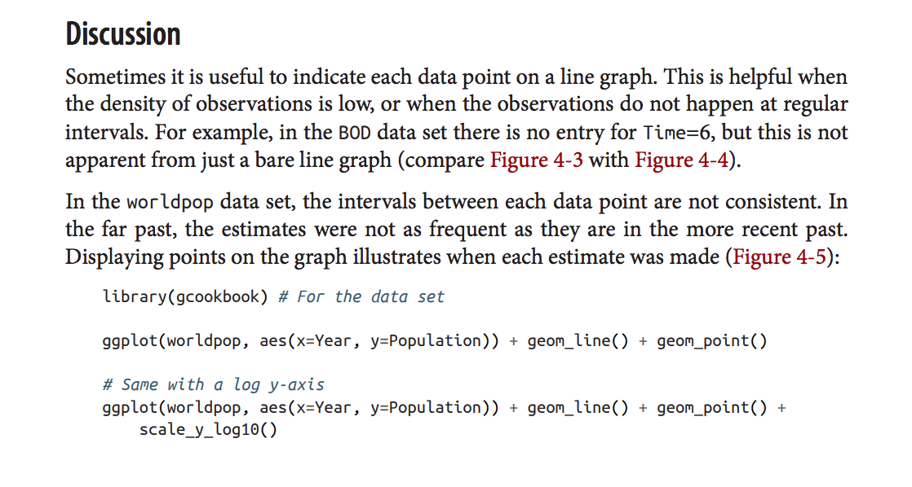
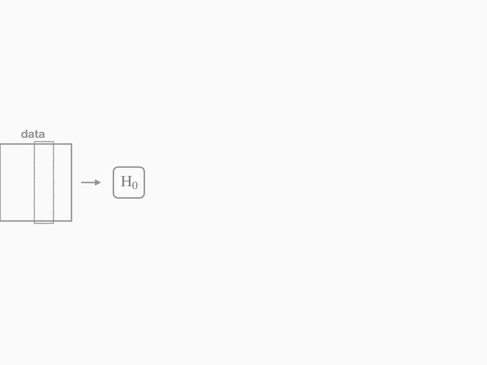

```{r, setup, include = FALSE}
knitr::opts_chunk$set(fig.width = 13, 
                      message = FALSE, 
                      warning = FALSE)
```

# Agenda 

## I. Cookbook Statistics
## II. An Alternative to a Cookbook
## III. Elements of Inference
## IV. An Alternative to Cookbook Statistics

---
class: center, middle

# I. Cookbook Statistics

---

# An old book

```{r out.width=600, echo = FALSE, fig.align='center'}
knitr::include_graphics("img/fisher-0.png")
```

---

# An old book

```{r out.width=600, echo = FALSE, fig.align='center'}

```

---

# An old book

```{r out.width=500, echo = FALSE, fig.align='center'}

```

---

# An old book

```{r out.width=600, echo = FALSE, fig.align='center'}

```

---

# A new book

```{r out.width=600, echo = FALSE, fig.align='center'}

```

---

# A new book

```{r out.width=600, echo = FALSE, fig.align='center'}

```

---

# A new book

```{r out.width=600, echo = FALSE, fig.align='center'}

```

---

# A new book

```{r out.width=600, echo = FALSE, fig.align='center'}
knitr::include_graphics("img/triola-4.png")
```

---

# A new book

```{r out.width=600, echo = FALSE, fig.align='center'}

```

---

# A new book

```{r out.width=600, echo = FALSE, fig.align='center'}

```

---

# Old vs New

```{r out.width=700, echo = FALSE, fig.align='center'}

```

---

# A self-identified cookbook!

```{r out.width=400, echo = FALSE, fig.align='center'}

```

---

# A self-identified cookbook!

```{r out.width=600, echo = FALSE, fig.align='center'}

```

---

# A self-identified cookbook!

```{r out.width=600, echo = FALSE, fig.align='center'}

```

---
class: center, middle

# II. An Alternative to a Cookbook

---

# Salt, Fat, Acid, Heat

```{r out.width=550, echo = FALSE, fig.align='center'}

```

---

# The Elements of Cooking

```{r out.width=500, echo = FALSE, fig.align='center'}

```

---

# The Elements of Cooking

> Liberated from recipes and precise shopping lists, you'll feel comfortable buying what looks best at the farmer's market or butcher's counter, confident in your ability to transform it into a balanced meal. You'll be better equipped to trust your own palate, to make substitutions in recipes, and cook with what's on hand. This book will change the way you *think* about cooking and eating, and help you find your bearings in the kitchen, with any ingredients, while cooking any meal. You'll start using recipes, including the ones in this book, like professional cooks do - for the inspiration, context, and general guidance they offer, rather than by following them to the letter.

-from the Introduction

---

# A Functional Syntax for Cooking

--

```{r eval = FALSE}
library(saltfatacidheat)
# someone please actually write this package
```


---

# Principled cooking

--

.pull-left[
```{r eval = FALSE}
chicken %>%
  salt("kosher", time = -12) %>%
  acid("buttermilk", time = -12) %>%
  fat("vegetable oil") %>%
  heat(375, time = .66)
```
```{r eval = FALSE}
> southern_fried_chicken
```
]

--

.pull-right[
```{r eval = FALSE}
chicken %>%
  salt("kosher", time = -12) %>%
 {{acid("lemon juice", time = -1) %>%}}
 {{fat("olive oil", time = -1) %>%}}
 {{heat(450, time = 1)}}
```
```{r eval = FALSE}
> roasted_chicken
```
]

--

### Themes

--

1. Consolidate shared principles into verbs/functions

--

2. Specify details through arguments

---

# Principled cooking, cont

--

.pull-left[
```{r eval = FALSE}
chicken %>%
  filter(part == "wing") %>%
  salt("kosher", time = -12) %>%
  fat("vegetable oil") %>%
  heat(350, time = .1) %>%
  acid("hot sauce") %>%
  fat("blue cheese dressing")
```
```{r eval = FALSE}
> buffalo_wings
```
]

--

.pull-right[
```{r eval = FALSE}
chicken %>%
  filter(part == "wing") %>%
  salt("kosher", time = -12) %>%
 {{fat("blue cheese dressing") %>%}}
  heat(350, time = .1) %>%
  acid("hot sauce") %>%
 {{fat("vegetable oil")}}
```
```{r eval = FALSE}
> warning: may cause GI distress
```
]

--

### Themes

1. Consolidate shared principles into verbs/functions

2. Specify details through arguments

--

3. Verbs can be repeated and nested

--

4. Order matters

--

5. Most combinations should *work*, but no guarantee on them working *well*.

---

# What I love about this book

--

- Memorize 4 concepts instead of many recipes
- Encourages experimentation and improvization
- Enables creativity
- Learning the links between dishes is satisfying

--

```{r out.width=450, echo = FALSE, fig.align='center'}

```

---
class: center, middle

# III. Elements of Inference

---

# Elements of Inference

```{r out.width=600, echo = FALSE, fig.align='center'}

```

---

# Elements of Inference

```{r out.width=600, echo = FALSE, fig.align='center'}

```

---

# Elements of Inference

```{r out.width=600, echo = FALSE, fig.align='center'}

```

---

# Elements of Inference

```{r out.width=600, echo = FALSE, fig.align='center'}

```

---

# Elements of Inference

```{r out.width=600, echo = FALSE, fig.align='center'}

```

---

# Elements of Inference

```{r out.width=600, echo = FALSE, fig.align='center'}

```

---

# Elements of Inference

```{r out.width=600, echo = FALSE, fig.align='center'}

```

---

# Elements of Inference

```{r out.width=600, echo = FALSE, fig.align='center'}

```

---

# Elements of Inference

```{r out.width=600, echo = FALSE, fig.align='center'}

```

---

# Elements of Inference

```{r out.width=600, echo = FALSE, fig.align='center'}

```

--

```{r eval = FALSE}
specify() %>% hypothesize() %>% generate() %>% calculate() %>% visualize()
```

---
class: center, middle

# IV. An Alternative to Cookbook Statistics

```{r out.width=200, echo = FALSE, fig.align='center'}
knitr::include_graphics("img/infer_gnome.png")
```

---

```{r echo = FALSE, warning = FALSE}
library(tidyverse)
library(infer)
library(ggplot2)
load(url("https://assets.datacamp.com/production/repositories/1703/datasets/487dcaff62e5c97f664a0c9de46623ad86a88be6/gss_sampled7.Rdata"))

gss <- filter(gss, year == 2016)

gss <- gss %>%
  filter(party != "Oth") %>%
  droplevels() %>%
  rename(space = natspac,
         military  = natarms) %>%
  select(year, age, happy, cappun, space, party)
 
chi_obs <- chisq_stat(gss, space ~ party)
```

# General Social Survey

```{r}
gss
```

---

# Test of independence

```{r part1, eval = FALSE}
gss %>%
  specify(space ~ party) #<<
```
--
```{r part1-out, ref.label="part1", echo = FALSE}
```

---

# Test of independence

```{r part2, eval = FALSE}
gss %>%
  specify(space ~ party) %>%
  hypothesize(null = "independence") #<<
```
--
```{r part2-out, ref.label="part2", echo = FALSE}
```

---

# Test of independence

```{r part3, eval = FALSE}
gss %>%
  specify(space ~ party) %>%
  hypothesize(null = "independence") %>%
  generate(reps = 500, type = "permute") #<<
```
--
```{r part3-out, ref.label="part3", echo = FALSE}
```

---

# Test of independence

```{r part4, eval = FALSE}
gss %>%
  specify(space ~ party) %>%
  hypothesize(null = "independence") %>%
  generate(reps = 500, type = "permute") %>%
  calculate(stat = "Chisq") #<<
```
--
```{r part4-out, ref.label="part4", echo = FALSE}
```

---

# Test of independence

```{r part5, eval = FALSE}
gss %>%
  specify(space ~ party) %>%
  hypothesize(null = "independence") %>%
  generate(reps = 500, type = "permute") %>%
  calculate(stat = "Chisq") %>%
  visualize() #<<
```
--
```{r part5-out, ref.label="part5", echo = FALSE}
```

---

# Test of independence

```{r part6, eval = FALSE}
gss %>%
  specify(space ~ party) %>%
  hypothesize(null = "independence") %>%
  generate(reps = 500, type = "permute") %>%
  calculate(stat = "Chisq") %>%
  visualize() + shade_p_value(obs_stat = chi_obs, direction = "greater") #<<
```
--
```{r part6-out, ref.label="part6", echo = FALSE}
```

---

# Test of independence

```{r part7, eval = FALSE}
gss %>%
  specify(space ~ party) %>%
  hypothesize(null = "independence") %>%
  generate(reps = 500, type = "permute") %>%
  calculate(stat = "Chisq") %>% 
  get_p_value(obs_stat = chi_obs, direction = "greater") #<<
```
--
```{r part7-out, ref.label="part7", echo = FALSE}
```

---

# Test of independence via approximation

--

```{r part8, eval = FALSE}
gss %>%
  specify(space ~ party) %>%
  hypothesize(null = "independence") %>%
  #generate(reps = 500, type = "permute") %>% #<<
  #calculate(stat = "Chisq") %>% #<<
  visualize(method = "theoretical") #<<
```
--
```{r part8-out, ref.label="part8", echo = FALSE}
```

---

# Test of independence two ways

```{r part9, eval = FALSE}
gss %>%
  specify(space ~ party) %>%
  hypothesize(null = "independence") %>%
  generate(reps = 500, type = "permute") %>%
  calculate(stat = "Chisq") %>%
  visualize(method = "both") #<<
```
--
```{r part9-out, ref.label="part9", echo = FALSE}
```

---

# Goodness of Fit Test

--

```{r echo = FALSE}
chi_obs <- chisq_stat(gss, party ~ NULL, p = c("Dem" = .33, "Ind" = .34, "Rep" = .33))
```


```{r part9b, eval = FALSE}
gss %>%
  specify(party ~ NULL) %>% #<<
  hypothesize(null = "point", #<<
              p = c("Dem" = .33, "Ind" = .34, "Rep" = .33)) %>% #<<
  generate(reps = 500, type = "simulate") %>% #<<
  calculate(stat = "Chisq") %>%
  visualize(obs_stat = chi_obs, direction = "greater")
```
--
```{r part9b-out, ref.label="part9b", echo = FALSE}
```

---

# Comparing Proportions

--

```{r part10, eval = FALSE}
gss %>%
  specify(happy ~ cappun, success = "HAPPY") %>% #<<
  hypothesize(null = "independence") %>%
  generate(reps = 500, type = "permute") %>%
  calculate(stat = "diff in props", order = c("FAVOR", "OPPOSE")) #<<
```
--
```{r part10-out, ref.label="part10", echo = FALSE}
```

---

# Comparing Proportions

```{r echo = FALSE}
diff_obs <- gss %>%
  group_by(cappun) %>%
  summarize(p = mean(happy == "HAPPY")) %>%
  summarize(diff_in_p = diff(p)) %>% pull() * -1
set.seed(30)
```

```{r part11, eval = FALSE}
gss %>%
  specify(happy ~ cappun, success = "HAPPY") %>%
  hypothesize(null = "independence") %>%
  generate(reps = 500, type = "permute") %>%
  calculate(stat = "diff in props", order = c("FAVOR", "OPPOSE")) %>%
  visualize(obs_stat = diff_obs, direction = "both") #<<
```
--
```{r part11-out, ref.label="part11", echo = FALSE}
```

---

# Intervals for Proportions

--

```{r part12, eval = FALSE}
gss %>%
  specify(happy ~ cappun, success = "HAPPY") %>%
  #hypothesize(null = "independence") %>% #<<
  generate(reps = 500, type = "bootstrap") %>% #<<
  calculate(stat = "diff in props", order = c("FAVOR", "OPPOSE")) %>%
  visualize()
```
--
```{r part12-out, ref.label="part12", echo = FALSE}
```

---

# Intervals for Proportions

```{r part13, eval = FALSE}
gss %>%
  specify(happy ~ cappun, success = "HAPPY") %>%
  #hypothesize(null = "independence") %>%
  generate(reps = 500, type = "bootstrap") %>%
  calculate(stat = "diff in props", order = c("FAVOR", "OPPOSE")) %>%
  get_confidence_interval(level = 0.95)  #<<
```
--
```{r part13-out, ref.label="part13", echo = FALSE}
```

---

# Agenda 

## I. Cookbook Statistics
## II. An Alternative to a Cookbook
## III. Elements of Inference
## IV. An Alternative to Cookbook Statistics

---
class: middle

> Think how much more we learn - and retain! - when a teacher doesn't just enumerate the step-by-step instructions but explains the principles behind them. Armed with reasons, we no longer have to cling to a recipe like a lifeboat; now we can strike out on our own and begin to improvise.

Michael Pollan, foreward to *Salt, Fat, Acid, Heat*.


---

# Collaborators
- Chester Ismary
- Evgeni Chasnovski
- Mine Cetinkaya-Rundel
- Ben Baumer
- Jo Hardin

# References
- [infer.netlify.com](http://www.infer.netlify.com)
- Nosrat, S. (2017). *Salt, Fat, Acid, Heat : Mastering the Elements of Good Cooking*. Simon and Schuster, New York, NY.
- Fisher R.A. (1934). *Statistical Methods for Research Workers*. Fifth Edition. Oliver and Boyd, London, UK.
- Triola, M. (2014). *Statdisk 12 Student Laboratory Manual and Workbook*. Pearson, New York, NY.
- Chang, W. (2013). *R Graphics Cookbook*. O'Reilly Media, Sebastopol, CA.

```{r out.width=150, echo = FALSE, fig.align='center'}
knitr::include_graphics("img/infer_gnome.png")
```


